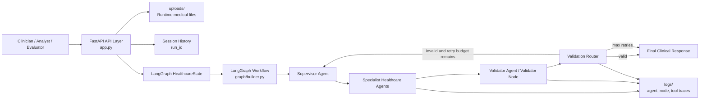
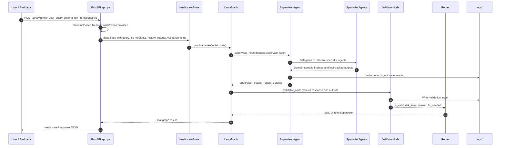
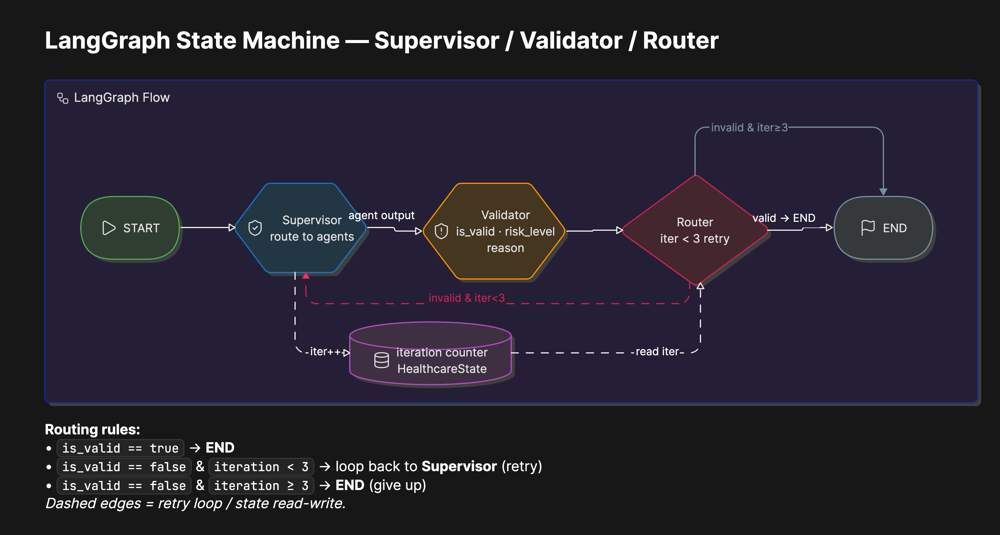
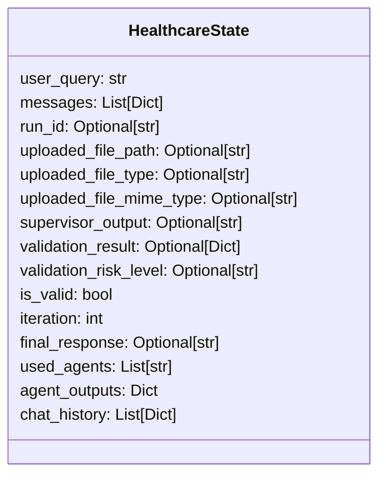
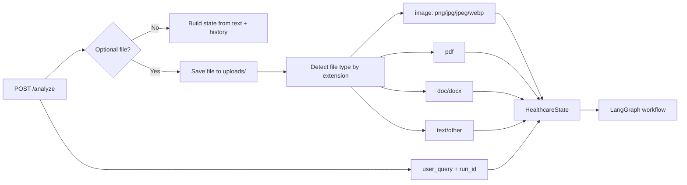
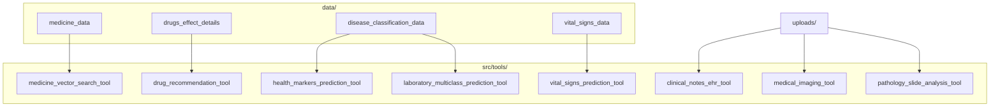
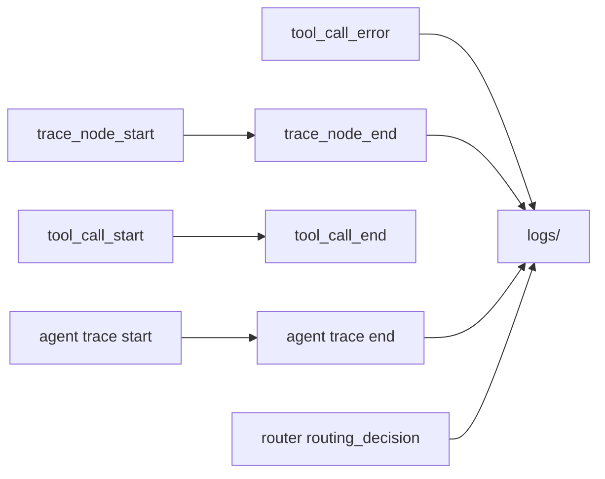
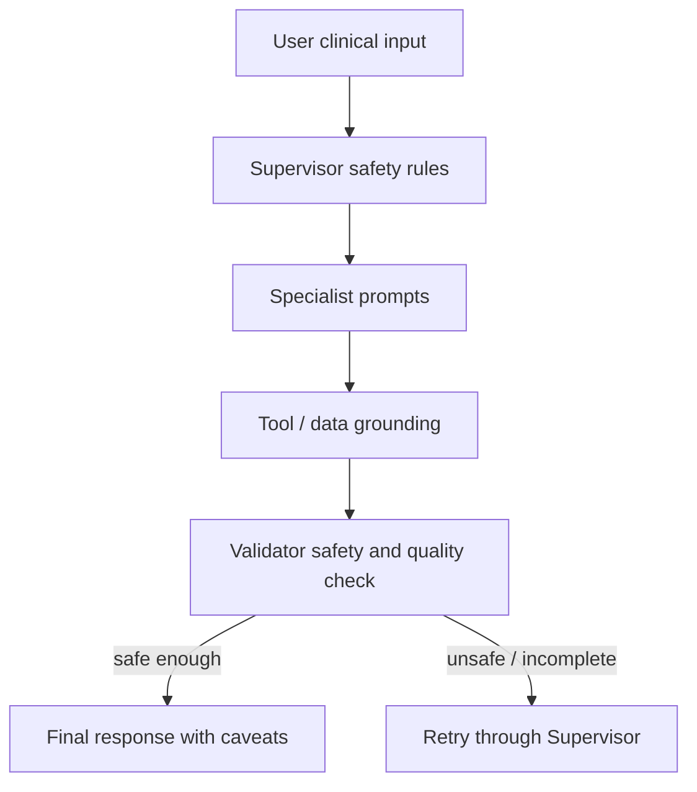

# Healthcare Multi-Agent AI System Architecture

## 1. Architecture Purpose

This document describes the architecture of the Healthcare Multi-Agent AI system for the G42 Agentathon Healthcare Diagnostics use case. It is written to make the agent collaboration, routing decisions, tools, data flow, validation loop, and submission-readiness gaps clear for reviewers and future maintainers.

The system is a clinical decision-support prototype. It accepts a healthcare query and optional medical file, builds a LangGraph state, lets a Supervisor Agent delegate work to specialist healthcare agents, validates the output, and returns a cautious final response.

> Safety boundary: the system supports clinical interpretation only. It must not be treated as autonomous diagnosis, treatment, or prescription authority.

---

## 2. Agentathon Guideline Alignment

The Agentathon guideline for Healthcare Diagnostics is:

- Use case: Healthcare Diagnostics
- Recommended `use_case_id`: `23`
- Domain: Healthcare / Life Sciences
- Difficulty: Very High
- Required emphasis: responsible clinical decision support, not autonomous diagnosis or treatment
- Expected outputs: structured symptom summary, differential diagnosis candidates, risk flags, suggested next diagnostic steps, and safety caveats

General Agentathon requirements reflected in this architecture:

- minimum two agents with clearly defined roles
- meaningful agent collaboration, not only a linear prompt chain
- logs or traces proving agent-to-agent interaction
- model calls through Compass or an OpenAI-compatible Compass endpoint
- documented agents, roles, tools, and data sources
- API server on port `8000`
- credentials kept out of source code

Current repository alignment note:

- The architecture and project domain align to Healthcare Diagnostics, which the guideline lists as `use_case_id = 23`.
- The current `metadata.json` should be checked before final submission because it currently declares `use_case_id = 1`.
- The current API exposes `POST /analyze`; if a strict validator expects `POST /run`, add a compatibility endpoint or document the deviation clearly.

---

## 3. System Context



The API layer owns request intake and file handling. LangGraph owns workflow state and routing. The Supervisor Agent owns delegation. Specialist agents own domain analysis. The Validator Node owns safety and quality review before the final response is returned.

---

## 4. Runtime Entry Points

| Component | File | Responsibility |
|---|---|---|
| API server launcher | `run.py` | Starts Uvicorn on port `8000`. |
| FastAPI app | `app.py` | Defines `/`, `/health`, `/analyze`, `/debug`, and `/history/{run_id}`. |
| Graph builder | `graph/builder.py` | Builds and compiles the active LangGraph workflow. |
| Graph state | `graph/state.py` | Defines shared state passed between nodes. |
| Supervisor node | `graph/nodes/supervisor_node.py` | Invokes the Supervisor Agent and collects specialist outputs. |
| Validator node | `graph/nodes/validator_node.py` | Checks final response quality and safety. |
| Router | `graph/nodes/router.py` | Sends valid runs to END or invalid runs back to Supervisor until retry limit. |
| LLM config | `config/llm.py` | Configures OpenAI-compatible chat model, embeddings, and raw OpenAI client. |
| Agent definitions | `src/agents/` | Defines Supervisor and specialist healthcare agents. |
| Tool definitions | `src/tools/` | Defines medical image, document, medicine, lab, and vital-sign tools. |

---

## 5. Main Request Flow



---

## 6. Supervisor-Centered Agent Topology

The Supervisor Agent is the central routing authority. It receives the merged current request and recent chat history, then decides which specialist agents should be invoked.


Implementation note:

- `src/agents/supervisor_agent.py` currently mounts the clinical documents, risk, diagnostic, drug, lab, symptom, and medical imaging specialist tools.
- `Vital Signs Monitoring Agent` exists in `src/agents/` and `metadata.json`, and it has a vital-sign prediction tool. If the final architecture claim is that the Supervisor has access to every listed specialist, add the vital signs agent to the Supervisor tool list before submission.

---

## 7. Specialist Agent and Tool Map

| Specialist agent | Current role | Direct tools |
|---|---|---|
| `Clinical Documents EHR Agent` | Reads and summarizes clinical documents, EHR notes, prescriptions, discharge summaries, and reports. | `pdf_medical_rag_tool` |
| `Medical Imaging Agent` | Interprets uploaded images and radiology-style context. | `analyze_medical_image`, backed by `medical_imaging_analysis_tool_` |
| `Lab Interpretation Agent` | Interprets lab values and biomarker patterns. | `predict_laboratory_disease_class`, `predict_health_markers_condition` |
| `Vital Signs Monitoring Agent` | Reviews vitals and physiological instability signals. | `predict_vital_signs_risk_category` |
| `Drug Recommendation Agent` | Provides medication information and medicine-context lookup. | `medicine_retrieval_tool` |
| `Risk Assessment Agent` | Flags severity, urgency, red flags, and escalation needs. | LLM reasoning only |
| `Diagnostic Reasoning Agent` | Produces cautious differential-style clinical reasoning. | LLM reasoning only |
| `Symptom Assistance Agent` | Structures symptoms and provides triage-style guidance. | LLM reasoning only |
| `Validator Agent` / `validator_node` | Validates response quality, grounding, and safety. | LLM validation prompt |

This topology satisfies the guideline expectation for dynamic delegation, role separation, evidence retrieval, risk assessment, and validation.

---

## 8. LangGraph Control Flow

The active graph is compact but non-linear because validation can route back to the Supervisor.



The graph is defined in `graph/builder.py`:

```text
StateGraph(HealthcareState)
  node: supervisor
  node: validator
  edge: supervisor -> validator
  conditional edge: validator -> supervisor | END
```

The router decision is defined in `graph/nodes/router.py`:

- valid output routes to `END`
- invalid output retries `supervisor`
- iteration count `>= 3` stops the loop to avoid unbounded execution

---

## 9. HealthcareState Model

The workflow state carries request context, session context, agent outputs, and validation information.



Implementation note:

- `app.py` initializes unified uploaded-file fields: `uploaded_file_path`, `uploaded_file_type`, and `uploaded_file_mime_type`.
- `graph/state.py` still contains some legacy image-specific field names. Aligning these state names is recommended before final submission.

---

## 10. Input and File Processing



Supported input categories:

- free-text clinical questions
- image uploads for imaging analysis
- PDF uploads for report or EHR analysis
- DOC/DOCX uploads for clinical document workflows
- session continuation through `run_id`

---

## 11. Data and Retrieval Architecture



Data handling rules from the guideline:

- keep static data in `data/`
- document data sources and licence notes
- do not include private or sensitive patient data
- do not commit API keys or private secrets
- keep execution practical within the evaluation time window

---

## 12. Observability and Trace Evidence

The architecture includes traceability at several levels.



Trace and logging locations:

- `logs/all_runs.jsonl`
- `logs/all_runs.json`
- `logs/all_runs.txt`
- `logs/healthcare_ai.json`

Important logged evidence for judging:

- which agent was invoked
- what routing decision was made
- what validator result was produced
- whether a retry or final route was selected
- tool start/end/error events where wrapped tools are used
- latency and status metadata where available

---

## 13. Safety Architecture



Safety controls:

- Supervisor routes to domain-specific specialists instead of forcing one model to answer everything.
- Specialist prompts should avoid definitive diagnosis, unsafe prescription, and emergency-care replacement.
- Risk assessment flags severity and possible escalation needs.
- Validator checks relevance, completeness, medical reasonableness, and hallucination risk.
- Final response should preserve uncertainty and remind users to seek qualified clinical review.

---

## 14. API Surface

| Endpoint | Method | Purpose |
|---|---|---|
| `/` | `GET` | Basic service status. |
| `/health` | `GET` | Health check. |
| `/analyze` | `POST` | Main healthcare analysis endpoint. Accepts multipart form fields. |
| `/debug` | `POST` | Returns detailed graph output for debugging. |
| `/history/{run_id}` | `GET` | Returns chat/session history for a run. |

Current main request format for `/analyze`:

```bash
curl -X POST http://localhost:8000/analyze   -F "user_query=Patient has fever, cough, low oxygen saturation, and elevated CRP. Provide a cautious clinical interpretation."   -F "run_id=optional-existing-session-id"
```

Optional file upload:

```bash
curl -X POST http://localhost:8000/analyze   -F "user_query=Review this report and summarize risks."   -F "file=@/path/to/report.pdf"
```

---

## 15. Deployment and Configuration

Runtime configuration is defined in `.env.example`, including local app settings and LLM runtime configuration loaded by `config/llm.py`.

Expected live model variables:

```bash
OPENAI_API_KEY=your-api-key-here
OPENAI_BASE_URL=https://api.core42.ai/v1
OPENAI_MODEL=gpt-5.1
OPENAI_EMBEDDING_MODEL=text-embedding-3-large
```

Run locally:

```bash
python -m venv .venv
source .venv/bin/activate
pip install -r requirements.txt
python run.py
```

Server:

```text
http://localhost:8000
```

---

## 16. Submission Readiness Checklist

| Guideline item | Current status | Action |
|---|---|---|
| Healthcare Diagnostics use case | Architecture aligns to Healthcare Diagnostics | Set `metadata.json` to `use_case_id = 23` if submitting this use case. |
| Minimum 2 agents | Yes | Keep roles documented in README and metadata. |
| Meaningful collaboration | Yes | Supervisor delegates, Validator reviews, Router retries. |
| Logs/traces | Yes | Keep logs in `logs/` and remove sensitive data. |
| Compass/OpenAI-compatible model calls | Yes | Ensure final runtime uses approved Compass endpoint and env vars. |
| API on port 8000 | Yes | `run.py` starts port `8000`. |
| Standard `/run` endpoint | Not currently present | Add `/run` wrapper if required by final validator. |
| README | Present | Keep aligned with final code. |
| Architecture doc | Present | This file documents agents, tools, flow, data, and safety. |
| `.env.example` | Present | Ensure it has placeholders only. |
| Input/output examples | Not clearly present | Add at least 3 input and 3 output examples before final submission. |
| Dockerfile | Not currently present | Add if required for final submission. |
| Data source/license notes | Partial | Add explicit source and licence notes for all files in `data/`. |
| Secrets | Must remain absent | Do not commit real Compass or API keys. |

---

## 17. Known Architecture Gaps To Close

These items are important because they affect whether documentation and implementation tell the same story:

1. Align `metadata.json` with Healthcare Diagnostics by using `use_case_id = 23`.
2. Add `Vital Signs Monitoring Agent` to the Supervisor tool list if the final system should route directly to every listed specialist.
3. Add a `POST /run` compatibility endpoint if the final evaluator requires the starter contract.
4. Add at least three request examples and three output examples.
5. Add or update Docker support if final deployment requires container validation.
6. Align `graph/state.py` field names with the unified uploaded-file fields initialized in `app.py`.
7. Document data source and licence notes for all static datasets under `data/`.

---

## 18. Summary

The system uses a Supervisor-led, LangGraph-orchestrated architecture with specialist healthcare agents, tool-backed data access, a validation loop, and trace logging. This is the right shape for the Agentathon Healthcare Diagnostics challenge because it demonstrates domain-specific delegation, safety review, retry behavior, and traceable multi-agent collaboration.

Before final submission, the most important work is to align metadata with Use Case `23`, expose any required standard endpoint, include examples, and ensure the Supervisor tool list matches the documented final agent set.
