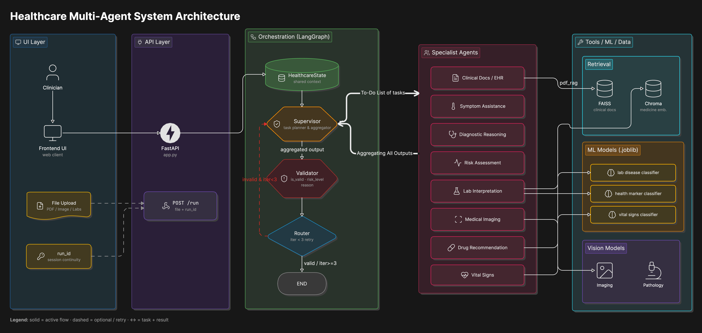
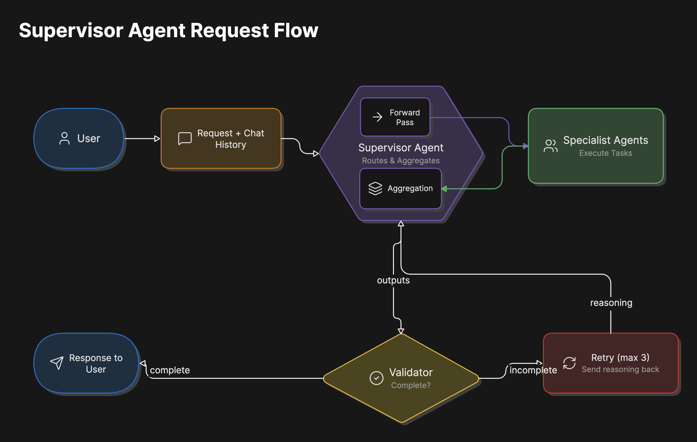
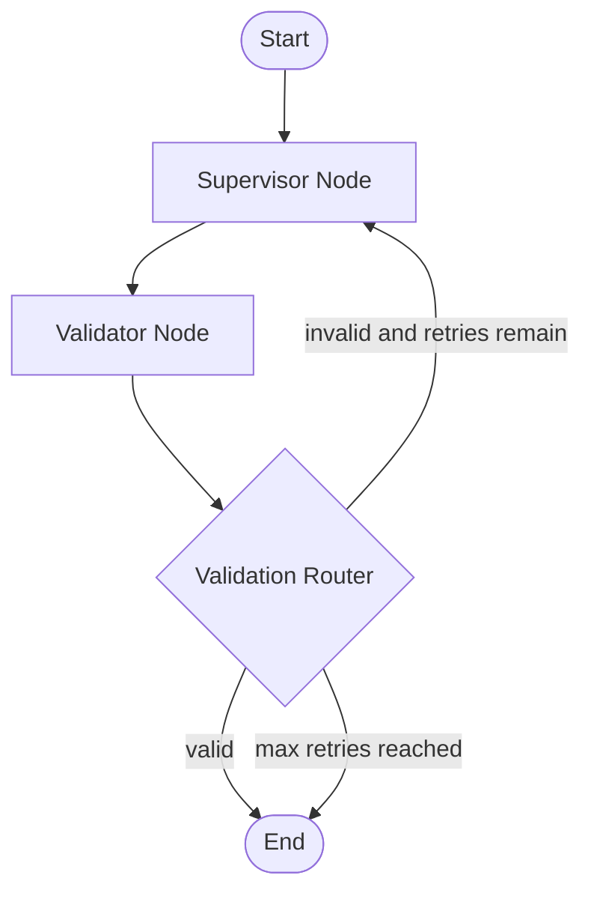
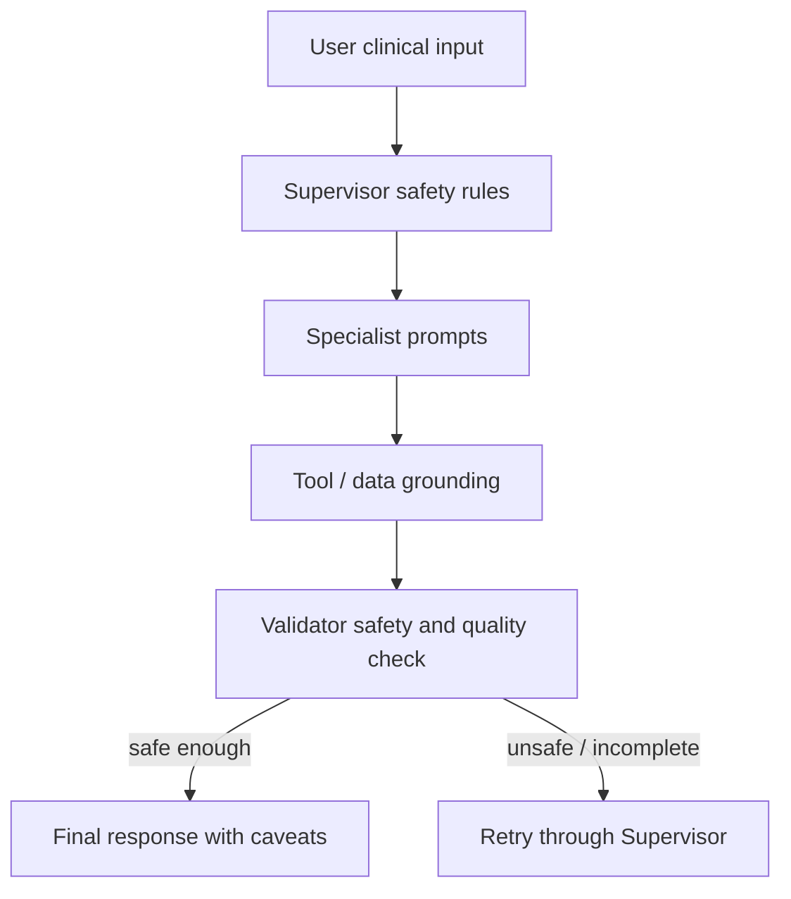

# Healthcare Multi-Agent AI System Architecture

## 1. Architecture Purpose

This document describes the architecture of the Healthcare Multi-Agent AI system for the G42 Agentathon Healthcare Diagnostics use case. It covers agent collaboration, routing decisions, tools, data flow, validation, and runtime configuration.

The system is a clinical decision-support prototype. It accepts a healthcare query and optional medical file, builds a LangGraph state, lets a Supervisor Agent delegate work to specialist healthcare agents, validates the output, and returns a cautious final response.

> Safety boundary: the system supports clinical interpretation only. It must not be treated as autonomous diagnosis, treatment, or prescription authority.

---

## 2. Agentathon Guideline Alignment

The Agentathon guideline for Healthcare Diagnostics is:

- Use case: Healthcare Diagnostics
- `use_case_id`: `23`
- Domain: Healthcare / Life Sciences
- Difficulty: Very High
- Required emphasis: responsible clinical decision support, not autonomous diagnosis or treatment
- Expected outputs: structured symptom summary, differential diagnosis candidates, risk flags, suggested next diagnostic steps, and safety caveats

---

## 3. High-Level System Architecture



The API layer owns request intake and file handling. LangGraph owns workflow state and routing. The Supervisor Agent owns delegation. Specialist agents own domain analysis. The Validator Node owns safety and quality review before the final response is returned.

---

## 4. Runtime Entry Points

| Component | File | Responsibility |
|---|---|---|
| API server launcher | `run.py` | Starts Uvicorn on port `8000`. |
| FastAPI app | `app.py` | Defines `/`, `/health`, `/run`, `/debug`, and `/history/{run_id}`. |
| Graph builder | `graph/builder.py` | Builds and compiles the active LangGraph workflow. |
| Graph state | `graph/state.py` | Defines shared state passed between nodes. |
| Supervisor node | `graph/nodes/supervisor_node.py` | Invokes the Supervisor Agent and collects specialist outputs. |
| Validator node | `graph/nodes/validator_node.py` | Checks final response quality and safety. |
| Router | `graph/nodes/router.py` | Sends valid runs to END or invalid runs back to Supervisor until retry limit. |
| LLM config | `config/llm.py` | Configures OpenAI-compatible chat model, embeddings, and raw OpenAI client. |
| Agent definitions | `src/agents/` | Defines Supervisor and specialist healthcare agents. |
| Tool definitions | `src/tools/` | Defines medical image, document, medicine, lab, and vital-sign tools. |

---

## 5. Main Request Flow



1. FastAPI receives `user_query`, optional `run_id`, and optional uploaded file.
2. The API saves uploaded files under `uploads/` and builds the initial `HealthcareState`.
3. LangGraph invokes the Supervisor Agent.
4. The Supervisor delegates to relevant specialist agents.
5. Specialist outputs return to the Supervisor for synthesis.
6. The Validator reviews the synthesized response for safety, completeness, and grounding.
7. The Router either ends the run or sends the case back to the Supervisor for refinement.
8. The API returns the final response, validation output, and specialist outputs.

---

## 6. Supervisor-Led Orchestration

The Supervisor Agent is the central routing authority. It receives the current request and recent chat history, decides which specialist agents to invoke, and synthesizes their outputs. The Validator reviews that synthesis; valid outputs are returned to the user, while incomplete or unsafe outputs are routed back to the Supervisor with feedback. The router enforces a bounded retry policy to prevent unbounded execution.


Implementation note:

- `src/agents/supervisor_agent.py` currently integrates the clinical documents, risk, diagnostic, drug, lab, symptom, and medical imaging specialist tools.
- `Vital Signs Monitoring Agent` is implemented in `src/agents/` and documented in `metadata.json`, with a dedicated vital-sign prediction tool.

---

## 7. Specialist Agent and Tool Map

| Specialist Agent | Responsibility | Tools |
|---|---|---|
| `Clinical Documents EHR Agent` | Reads and summarizes clinical documents, EHR notes, prescriptions, discharge summaries, and reports. | `pdf_medical_rag_tool` |
| `Medical Imaging Agent` | Analyzes uploaded medical images and generates imaging-focused observations. | `analyze_medical_image`, backed by `medical_imaging_analysis_tool_` |
| `Lab Interpretation Agent` | Interprets lab values and biomarker patterns. | `predict_laboratory_disease_class`, `predict_health_markers_condition` |
| `Vital Signs Monitoring Agent` | Reviews vitals and physiological instability signals. | `predict_vital_signs_risk_category` |
| `Drug Recommendation Agent` | Provides medication information and medicine-context lookup. | `medicine_retrieval_tool` |
| `Risk Assessment Agent` | Flags severity, urgency, red flags, and escalation needs. | LLM reasoning only |
| `Diagnostic Reasoning Agent` | Produces differential-style clinical reasoning and potential diagnostic considerations for review. | LLM reasoning only |
| `Symptom Assistance Agent` | Structures symptoms and provides triage-style guidance. | LLM reasoning only |
| `Validator Agent` / `validator_node` | Validates response quality, grounding, and safety. | LLM validation prompt |

This topology satisfies the guideline expectation for dynamic delegation, role separation, evidence retrieval, risk assessment, and validation.

---

## 8. LangGraph Control Flow

The active graph is compact but non-linear because validation can route back to the Supervisor.



The graph is defined in `graph/builder.py`:

```text
StateGraph(HealthcareState)
  node: supervisor
  node: validator
  edge: supervisor -> validator
  conditional edge: validator -> supervisor | END
```

The router decision is defined in `graph/nodes/router.py`:

- valid output routes to `END`
- invalid output retries `supervisor`
- iteration count `>= 3` stops the loop to avoid unbounded execution

---

## 9. HealthcareState Model

The workflow state carries request context, session context, agent outputs, and validation information.

Key state fields:

- User and session context: `user_query`, `messages`, `run_id`, `chat_history`
- Uploaded file context: `uploaded_file_path`, `uploaded_file_type`, `uploaded_file_mime_type`
- Agent execution context: `supervisor_output`, `used_agents`, `agent_outputs`
- Validation and response context: `validation_result`, `validation_risk_level`, `is_valid`, `iteration`, `final_response`

Implementation note:

- `app.py` initializes unified uploaded-file fields: `uploaded_file_path`, `uploaded_file_type`, and `uploaded_file_mime_type`.
- `graph/state.py` carries the shared runtime fields used by graph nodes during execution.

---

## 10. Input and File Processing

Supported input categories:

- free-text clinical questions
- medical image uploads for imaging-focused analysis
- PDF uploads for report or EHR analysis
- DOC/DOCX uploads for clinical document workflows
- session continuation through `run_id`

Uploaded files are stored in `uploads/`, classified by extension and MIME context, and attached to `HealthcareState` for downstream specialist tools.

---

## 11. Data and Retrieval Architecture

| Data area | Used by |
|---|---|
| `data/medicine_data` | `medicine_vector_search_tool` |
| `data/drugs_effect_details` | Drug-related support tools |
| `data/disease_classification_data` | Lab and health-marker prediction tools |
| `data/vital_signs_data` | Vital-sign risk prediction tooling |
| `uploads/` | Clinical document, imaging, and pathology tools |

Data management principles:

- keep static data in `data/`
- document data sources and licence notes
- do not include private or sensitive patient data
- do not commit API keys or private secrets
- keep execution practical within the evaluation time window

---

## 12. Observability and Trace Evidence

The system writes trace events for graph execution, agent activity, routing decisions, validator results, tool calls, latency, and runtime status.

Trace files:

- `logs/healthcare_agent_trace.jsonl`
- `logs/chat_history.jsonl`

Captured telemetry:

- Invoked agents and specialist outputs
- Router decisions and retry paths
- Validator result, risk level, and feedback
- Tool start, end, and error events
- Latency and status metadata where available

---

## 13. Safety Architecture



Safety controls:

- Supervisor routes requests to domain-specific specialist agents when additional expertise or tool access is required.
- Specialist prompts avoid definitive diagnosis, unsafe prescription, and emergency-care replacement.
- Risk assessment flags severity and possible escalation needs.
- Validator checks relevance, completeness, medical reasonableness, and hallucination risk.
- Final response preserves uncertainty and reminds users to seek qualified clinical review.

---

## 14. API Surface

| Endpoint | Method | Purpose |
|---|---|---|
| `/` | `GET` | Basic service status. |
| `/health` | `GET` | Health check. |
| `/run` | `POST` | Main healthcare analysis endpoint. Accepts multipart form fields. |
| `/debug` | `POST` | Returns detailed graph output for debugging. |
| `/history/{run_id}` | `GET` | Returns chat/session history for a run. |

Current main request format for `/run`:

```bash
curl -X POST http://localhost:8000/run   -F "user_query=Patient has fever, cough, low oxygen saturation, and elevated CRP. Provide a cautious clinical interpretation."   -F "run_id=optional-existing-session-id"
```

Optional file upload:

```bash
curl -X POST http://localhost:8000/run   -F "user_query=Review this report and summarize risks."   -F "file=@/path/to/report.pdf"
```

---

## 15. Deployment and Configuration

Runtime configuration is defined in `.env.example`, including local app settings and LLM runtime configuration loaded by `config/llm.py`.

Expected live model variables:

```bash
OPENAI_API_KEY=your-api-key-here
OPENAI_BASE_URL=https://api.core42.ai/v1
OPENAI_MODEL=gpt-5.1
OPENAI_EMBEDDING_MODEL=text-embedding-3-large
```

Run locally:

```bash
python -m venv .venv
source .venv/bin/activate
pip install -r requirements.txt
python run.py
```

Server:

```text
http://localhost:8000
```

---

## 16. Operational Notes

The active API contract uses `POST /run`. Generated runtime artifacts such as vector databases, uploads, Python caches, and notebook checkpoints are excluded from version control.

---

## 17. Summary

The system uses a Supervisor-led, LangGraph-orchestrated architecture with specialist healthcare agents, tool-backed data access, a validation loop, and trace logging. The architecture demonstrates domain-specific delegation, validation-aware routing, traceable multi-agent collaboration, and tool-grounded clinical decision support aligned with the Healthcare Diagnostics use case.

The repository includes documented agents, tool-backed data access, example inputs and outputs, and sample runtime configuration suitable for local execution.
