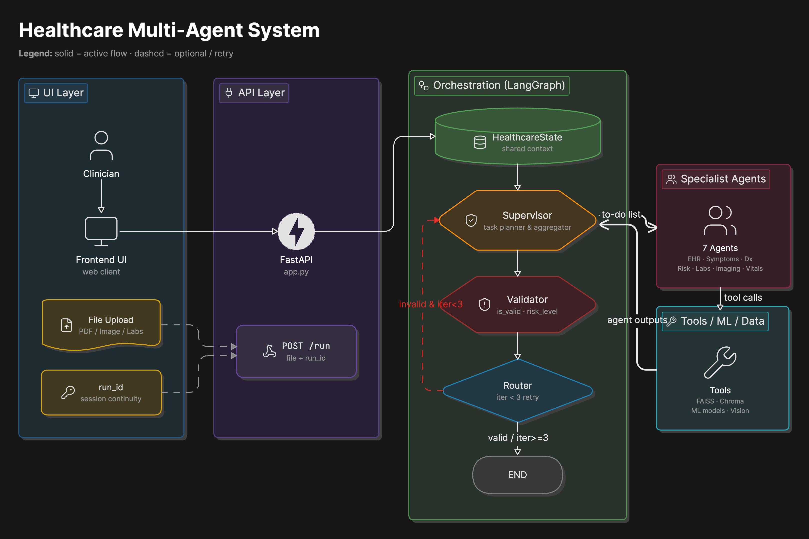
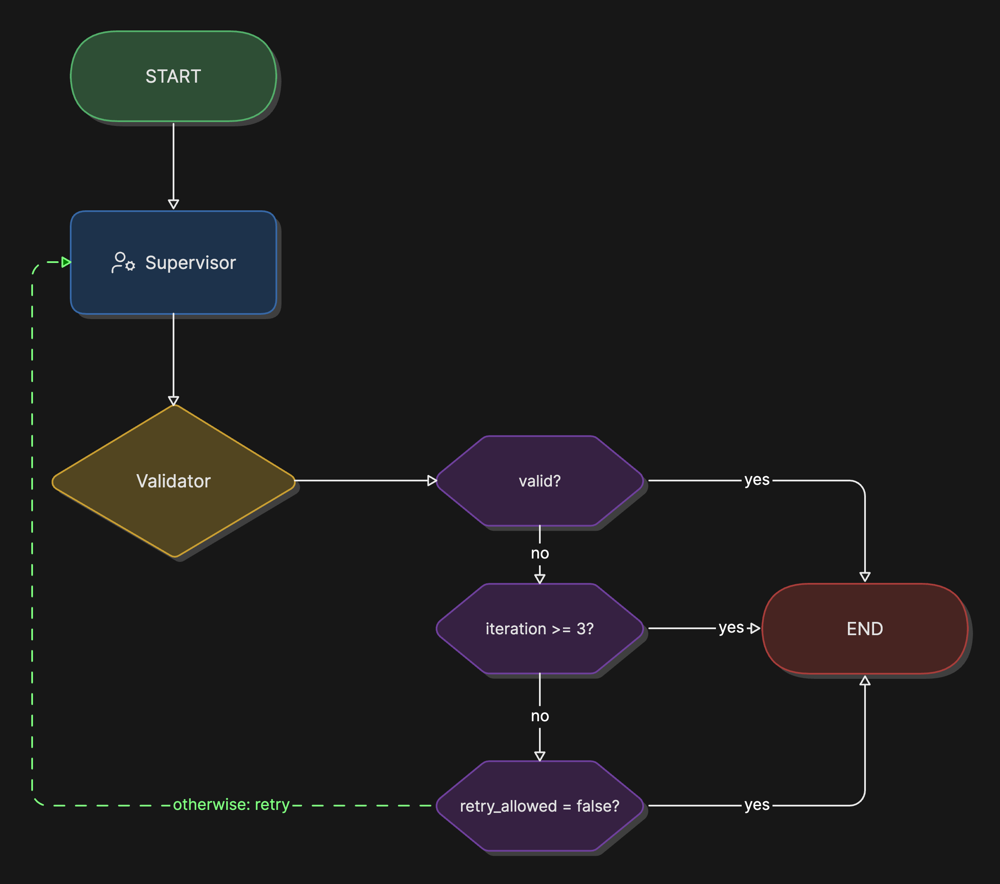

# Healthcare Multi-Agent Clinical Intelligence System

**G42 Agentathon | Healthcare Diagnostics | Multi-Agent Clinical Decision Support, Clinical Reasoning, Risk Assessment, Medical Interpretation, and Clinical Documentation Analysis**

This repository implements a healthcare-focused multi-agent AI system that accepts symptoms, clinical notes, laboratory findings, medical records, imaging inputs, and drug-related context, routes the work to specialist agents, validates the result, and returns a structured clinical intelligence response.

> ⚠️ Safety note: this project is a clinical decision-support prototype. It is not a replacement for qualified healthcare professionals.

---

## 🩺 1. Problem Statement

Healthcare decision-making is complex, data-heavy, and rarely driven by a single source of information. A seemingly simple request such as **"Why is this patient's oxygen level dropping?"** can quickly expand into multiple interconnected clinical investigations involving **symptoms, laboratory findings, imaging results, medication history, and prior medical records**.

Healthcare professionals operate in environments where **accuracy, timeliness, and patient safety** are critical. Every day, they must synthesize fragmented clinical data while identifying risks, prioritizing urgent conditions, and ensuring no critical signals are missed.

While traditional AI systems can generate responses quickly, they often attempt to handle all reasoning in a single pass. This creates several challenges:

- Limited transparency into **clinical reasoning steps**  
- Difficulty validating **medical conclusions**  
- Reduced traceability across **symptoms, labs, and imaging**  
- Challenges processing **heterogeneous medical documents**  
- Increased risk of missing **critical risk signals or contraindications**

---

## 💡 What This System Does

The **Healthcare Multi-Agent Clinical Intelligence System**  integrates multiple specialist agents under a coordinated supervisor workflow to generate structured clinical decision-support outputs, combining domain-specific reasoning, tool-based evidence, and validation feedback.

Instead of relying on a single AI model, the system distributes reasoning across dedicated healthcare agents, each responsible for a specific clinical domain. A central **Clinical Supervisor Agent** coordinates the workflow, while a structured validation process ensures consistency and safety in the returned response.

This architecture is inspired by multidisciplinary clinical review workflows:

- 🤒 **Symptom Assistance Agent** analyzes patient-reported symptoms and clinical presentation  
- ⚠️ **Risk Assessment Agent** identifies red flags and escalation requirements  
- 🧠 **Diagnostic Reasoning Agent** generates clinical hypotheses and differential reasoning  
- 🧪 **Lab Interpretation Agent** evaluates laboratory results and biomarkers  
- 🩻 **Medical Imaging Agent** interprets radiology and imaging findings  
- 💊 **Drug Recommendation Agent** analyzes medications and potential interactions  
- 📄 **Clinical Documents EHR Agent** extracts insights from clinical notes, EHR data, and reports  
- ❤️ **Vital Signs Monitoring Agent** tracks physiological indicators such as oxygen saturation, blood pressure, and heart rate  

By combining these specialists under a coordinated supervisor workflow, the system produces structured clinical decision-support outputs that combine specialist-agent reasoning, tool-derived evidence, and validation feedback.

---

## 🚀 Multi-Agent Clinical Intelligence Approach

The system is designed as a multi-agent clinical reasoning architecture with the following characteristics:

- 🧠 Uses **specialized clinical agents instead of one general model**  
- 🔍 Grounds responses in **retrieved clinical context and structured medical inputs**  
- ⚖️ Applies **multi-agent validation across clinical reasoning outputs**  
- 📄 Handles **large medical documents via Clinical Documents EHR Agent with PDF ingestion support**  
- 🩻 Supports **multi-modal clinical inputs including labs, imaging, vitals, and EHR data**  
- 🧾 Produces **traceable and review-ready clinical intelligence outputs**  
- 🔄 Uses a **supervisor-driven orchestration workflow instead of a single reasoning chain**  

---
## 👥 Intended Users

This system is designed to support:

- 🏥 **Clinicians and healthcare providers** in supporting diagnosis and patient review workflows  
- 🧪 **Hospital clinical decision-support teams** handling triage and case analysis  
- 📊 **Healthcare analytics teams** working with large-scale patient and medical datasets  
- 🧠 **Medical AI researchers** developing clinical reasoning and multi-agent systems  
- 📝 **Healthcare documentation teams** summarizing EHRs, discharge notes, and reports  
- ⚕️ **Risk management and patient safety teams** identifying early warning signals  
- 🤖 **AI healthcare product teams** building clinical intelligence applications  
---
## 🎯 System Objectives

The system is designed to provide:

- Structured clinical information synthesis
- Traceable specialist-agent reasoning
- Tool-grounded clinical interpretation
- Reviewable outputs for healthcare workflows

---

## 2. Use Case ID

- Intended Agentathon use case: `23`
- Use case name: Healthcare Diagnostics
- Domain: Healthcare / Life Sciences
- Difficulty: Very High

The project metadata uses Healthcare Diagnostics Use Case `23`, matching the repository domain and architecture.

---

## 3. Solution Overview

The system exposes a FastAPI application on port `8000`. A user submits a healthcare query, optionally with an uploaded medical file. The API builds a LangGraph state, sends the case to a Supervisor Agent, routes work to relevant healthcare specialist agents, validates the generated response, and returns a final clinical decision-support response.

Core capabilities:

- Clinical question analysis through `POST /run`
- Optional upload support for images, PDFs, DOC/DOCX files, and text-like documents
- LangGraph orchestration with supervisor and validator nodes
- Specialist agents for symptoms, risk, diagnostics, labs, vitals, imaging, medications, and clinical documents
- Tool-backed retrieval and prediction for medicine data, lab classification, health markers, vital signs, imaging, and document processing
- Session continuity through `run_id`
- Logs and traces under `logs/`

### Core Architectural Characteristics

- Supervisor-driven multi-agent orchestration using LangGraph
- Specialist healthcare agents operating on domain-specific clinical tasks
- Tool-augmented reasoning through predictive models and retrieval systems
- Validator-based response quality and safety assessment
- Support for structured and unstructured clinical data, including laboratory findings, imaging inputs, vital signs, and clinical documents
- Session-aware execution with traceable agent interactions
---

## 4. Agent Architecture

The architecture is supervisor-centered. The Supervisor Agent receives the user case and decides which specialist agents to call.




Agent roles:

| Agent | Role |
|---|---|
| `Supervisor Agent` | Coordinates workflow execution, routes tasks, and synthesizes specialist outputs. |
| `Symptom Assistance Agent` | Structures symptoms and provides triage-style symptom support. |
| `Risk Assessment Agent` | Flags severity, red flags, urgency, and escalation needs. |
| `Diagnostic Reasoning Agent` | Produces cautious differential-style clinical reasoning. |
| `Lab Interpretation Agent` | Interprets lab values, biomarkers, and abnormal clinical tests. |
| `Vital Signs Monitoring Agent` | Reviews vital signs and physiological instability patterns. |
| `Medical Imaging Agent` | Analyzes uploaded medical images and generates imaging-focused observations. |
| `Drug Recommendation Agent` | Provides medicine information and medication-support context. |
| `Clinical Documents EHR Agent` | Processes clinical PDFs, EHR notes, prescriptions, and discharge summaries. |
| `Validator Agent` | Reviews output quality, grounding, completeness, and safety. |

---

## 5. Agent Collaboration Flow

The system uses a LangGraph workflow with validation-aware routing and retry behavior.



Runtime flow:

1. FastAPI receives `user_query`, optional `run_id`, and optional uploaded file.
2. Uploaded files are saved under `uploads/`.
3. The API builds a `HealthcareState` with query, messages, file metadata, chat history, and empty output fields.
4. LangGraph starts at the supervisor node.
5. The Supervisor Agent delegates to relevant specialist agents.
6. Specialist agents may call domain tools and return structured outputs.
7. The validator checks the response for quality, safety, and medical coherence.
8. The router either ends the run or sends the case back to the Supervisor for refinement.
9. The API returns the final response, validation critique, and agent outputs.

---

## 6. Tools, Frameworks, and Models Used

Frameworks and libraries:

- FastAPI
- Uvicorn
- LangGraph
- LangChain
- OpenAI-compatible client through `langchain-openai`
- Pydantic
- Python dotenv
- Pandas
- scikit-learn
- Pillow
- PyPDF / PyPDF2
- OpenTelemetry libraries

Model configuration:

- Chat model: configured in `config/llm.py`
- Default model: `gpt-5.1`
- Embedding model: `text-embedding-3-large`
- Base URL: OpenAI-compatible Compass/Core42 endpoint from environment variables

Custom tools:

| Tool | Purpose |
|---|---|
| `pdf_medical_rag_tool` | Clinical document and PDF analysis. |
| `medical_imaging_analysis_tool_` | Uploaded image interpretation support. |
| `medicine_retrieval_tool` | Medicine data retrieval. |
| `predict_laboratory_disease_class` | Lab disease classification support. |
| `predict_health_markers_condition` | Health marker prediction support. |
| `predict_vital_signs_risk_category` | Vital signs risk prediction support. |
| `pathology_slide_analysis_tool` | Pathology slide analysis support. |

---

## 7. Data Sources

Static data is stored under `data/`:

```text
data/
├── disease_classification_data/
│   ├── health_markers_dataset.csv
│   └── laboratory__data.csv
├── drugs_effect_details/
│   └── drugs_cleaned_dataset.xls
├── medicine_data/
│   ├── Medicine_Details.csv
│   └── medicine_details_embedding_corpus.txt
└── vital_signs_data/
    └── human_vital_signs_dataset_2024.csv
```

Data handling rules:

- Do not include private, sensitive, or restricted patient data.
- Keep static data lightweight enough for standard CPU execution.
- Use public, anonymized, synthetic, or otherwise permitted datasets only.
- Data source references are listed in `metadata.json`.
- Do not commit credentials, API keys, or private medical records.

---

## 8. Repository Structure

```text
healthcare_ai_repo/
├── app.py                         # FastAPI app, upload handling, graph execution
├── run.py                         # Starts API server on port 8000
├── metadata.json                  # Agentathon metadata
├── requirements.txt               # Python dependencies
├── README.md                      # Project instructions
├── ARCHITECTURE.md                # Detailed architecture notes
├── .env.example                   # Runtime environment template
├── config/
│   └── llm.py                     # LLM and embeddings configuration
├── graph/
│   ├── builder.py                 # LangGraph workflow definition
│   ├── state.py                   # Workflow state schema
│   └── nodes/
│       ├── supervisor_node.py     # Supervisor workflow node
│       ├── validator_node.py      # Validation workflow node
│       └── router.py              # Conditional route after validation
├── src/
│   ├── agents/                    # Supervisor and specialist agents
│   ├── tools/                     # Medical tools and prediction helpers
│   └── utils/                     # Logging, tracing, and shared helpers
├── prompts/                       # Agent and validator prompts
├── data/                          # Static healthcare datasets
├── logs/                          # Run logs and trace evidence
├── scripts/                       # Utility scripts
├── input_examples/                # Sample request payloads
├── output_examples/               # Sample response payloads
└── uploads/                       # Runtime upload storage
```

---

## 9. Environment Variables

The LLM configuration is loaded by `config/llm.py`.

Required for live LLM execution:

```bash
OPENAI_API_KEY=your-api-key-here
OPENAI_BASE_URL=https://api.core42.ai/v1
OPENAI_MODEL=gpt-5.1
OPENAI_EMBEDDING_MODEL=text-embedding-3-large
```

Basic app settings from `.env.example`:

```bash
APP_ENV=development
LOG_LEVEL=INFO
API_HOST=127.0.0.1
API_PORT=8000
```

Never commit real values for `OPENAI_API_KEY` or other secrets.

---

## 10. Setup Instructions

From the parent directory, change into the project folder:

```bash
cd healthcare_intelligence
```

Create and activate a virtual environment:

```bash
python3 -m venv venv
source venv/bin/activate
```

Install dependencies:

```bash
pip install -r requirements.txt
```

Configure `.env.example` with the model endpoint, model name, embedding model, and API key expected by `config/llm.py`.

---

## 11. How to Run Locally

Start the API server:

```bash
python run.py
```

The API runs at:

```text
http://localhost:8000
```

Check health:

```bash
curl http://localhost:8000/health
```

Expected response:

```json
{
  "status": "healthy"
}
```

---

## 12. Runtime Notes

This repository is configured for local FastAPI execution through `python run.py`. Runtime settings are provided through `.env.example`, and generated runtime artifacts such as vector databases and uploads are excluded from Git.

---

## 13. API Usage

### `GET /`

Returns basic service status.

```bash
curl http://localhost:8000/
```

### `GET /health`

Returns health status.

```bash
curl http://localhost:8000/health
```

### `POST /run`

Primary clinical intelligence analysis endpoint. It accepts multipart form fields.

Required:

- `user_query`

Optional:

- `run_id`
- `file`

Example without file:

```bash
curl -X POST http://localhost:8000/run \
  -F "user_query=Patient has fever, cough, low oxygen saturation, and elevated CRP. Provide a cautious clinical interpretation."
```

Example with file:

```bash
curl -X POST http://localhost:8000/run \
  -F "user_query=Review this uploaded clinical report and summarize key risks." \
  -F "file=@/path/to/report.pdf"
```

### `POST /debug`

Returns detailed graph output for debugging.

```bash
curl -X POST http://localhost:8000/debug \
  -F "user_query=Assess headache, fever, neck stiffness, and confusion."
```

### `GET /history/{run_id}`

Returns stored chat history for a session.

```bash
curl http://localhost:8000/history/<run_id>
```

The main analysis endpoint is `POST /run`.

---

## 14. Input and Output Examples

### Example Input

```bash
curl -X POST http://localhost:8000/run \
  -F "user_query=Patient reports chest pain, shortness of breath, dizziness, and high blood pressure. Provide a cautious triage-oriented interpretation."
```

### Example Output Shape

```json
{
  "request_id": "uuid",
  "run_id": "uuid",
  "status": "success",
  "final_response": "Structured clinical decision-support response with caveats.",
  "critique": {
    "is_valid": true,
    "risk_level": "moderate",
    "reason": "Response is clinically cautious and includes escalation advice."
  },
  "task_outputs": {
    "Risk Assessment Agent": {
      "input": "Patient reports chest pain, shortness of breath...",
      "output": "Risk-focused assessment..."
    },
    "Diagnostic Reasoning Agent": {
      "input": "Clinical context...",
      "output": "Differential-style interpretation..."
    }
  }
}
```

Additional sample request and response payloads are available under `input_examples/` and `output_examples/`.

---

## 15. Logs and Traces

The application writes trace and run artifacts under `logs/`:

```text
logs/
├── healthcare_ai.json
├── all_runs.txt
├── all_runs.json
└── all_runs.jsonl
```

Logs are used to demonstrate:

- supervisor routing decisions
- specialist-agent activity
- validator output
- retry or final routing decisions
- tool call start/end/error events
- graph execution history

Do not commit logs containing private patient data, API keys, or sensitive uploaded-file content.

---

## 16. Demo Flow

1. Start the API locally.
2. Show health check on port `8000`.
3. Submit a healthcare case to `POST /run`.
4. Show the final response.
5. Show logs/traces proving multi-agent collaboration.
6. Explain safety boundaries and known limitations.

---

## 17. Known Limitations

- The current repository focuses on application functionality and multi-agent orchestration; containerized deployment (e.g., Docker) is not included within the present scope.
- Uploaded document and image processing support common healthcare file formats. The quality and depth of analysis may vary depending on document structure, image quality, extracted content, and the capabilities of the relevant specialist agents and tools.
- The system is intended solely as a clinical decision-support solution. All outputs are generated to assist healthcare workflows and should not be considered medical diagnoses, or a substitute for professional clinical judgment.

---

## 18. Extension Areas

- Container packaging and smoke tests.
- Automated tests for `/health`, `/run`, validation routing, and tool calls.
- Richer trace visualization for agent handoffs and tool execution.
- Stronger PHI redaction and upload validation.

---

## Related Documentation

- `ARCHITECTURE.md`
- `metadata.json`
- `app.py`
- `graph/builder.py`
- `config/llm.py`
